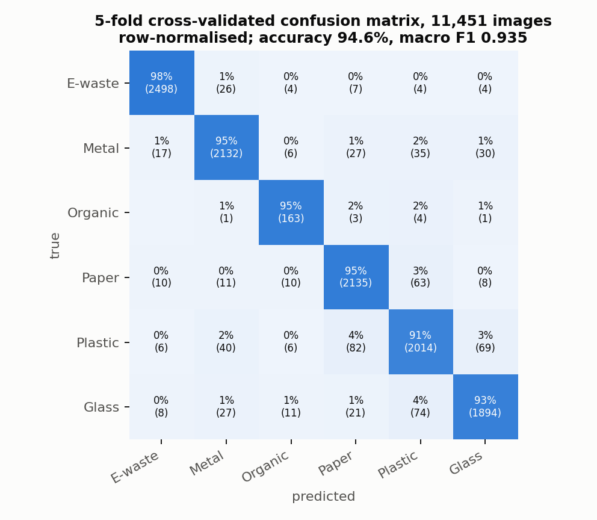

# BluePort AI · website and in-browser demo

**Drop a photo of a waste item and a CLIP model running inside your browser sorts it into one of six recycling streams. 94.6% cross-validated accuracy on 11,451 images; no photo leaves your device**

[](https://blue-port-ia.vercel.app/#try)
[](https://huggingface.co/spaces/Darliane/blueport-ai)
[](https://github.com/darlianecunha/blueport-ai2)
[](LICENSE)

<p align="center">
  
</p>

## What this is

The public face of BluePort AI, a waste-classification project for ports. This repository is the static website deployed on Vercel and mirrored as a Hugging Face Space. There is no server: the page downloads a quantised CLIP ViT-B/32 image encoder once (about 90 MB, then cached), computes a 512-dimensional embedding of the photo locally and applies a logistic-regression head of 3,078 parameters stored in `probe.json`.

Classes: **e-waste, metal, organic, paper/cardboard, plastic, glass**. Each result shows the top three classes, a confidence score and a handling hint that refers to MARPOL Annex V where relevant. Predictions under 50% confidence are flagged as uncertain.

| Indicator | Value |
|---|---|
| Training images | 11,451 (public collections including TACO and TrashNet) |
| Evaluation | 5-fold stratified cross-validation, every image predicted by a model that never saw it |
| Accuracy | 0.946 (balanced accuracy 0.945, macro F1 0.935) |
| Weakest class | Organic, 172 images: recall 0.95, precision 0.82 |
| Time per photo | about 1 s after the first load, on a laptop |

## Architecture

```
browser: photo → CLIP ViT-B/32 (ONNX, Transformers.js) → 512-d embedding, L2-normalised
       → probe.json (6 × 512 weights + 6 biases) → softmax → label, confidence, hint
```

The BluePort project has three repositories:

| Repository | Role |
|---|---|
| **blue-port-ia** (this one) | Website and in-browser demo, deployed on Vercel and Hugging Face |
| [blueport-ai2](https://github.com/darlianecunha/blueport-ai2) | Model: feature extraction, cross-validated training, weights, evaluation report, offline Telegram bot |
| [blueport-telegram-bot](https://github.com/darlianecunha/blueport-telegram-bot) | Serverless Telegram bot ([@blueportbot](https://t.me/blueportbot)) on Vercel |

## Running locally

```bash
git clone https://github.com/darlianecunha/blue-port-ia
cd blue-port-ia
python -m http.server 8000     # then open http://localhost:8000
```

A local server is needed because browsers block ES modules opened from `file://`.

## Repository map

| Path | Content |
|---|---|
| `index.html` | Page, layout and upload interface |
| `classifier.js` | Loads CLIP through Transformers.js, applies the linear head, renders the result |
| `probe.json` | Logistic-regression weights exported from [blueport-ai2](https://github.com/darlianecunha/blueport-ai2) |
| `examples/` | Six sample photos used by the "try an example" buttons |
| `assets/` | Confusion matrix and other figures |

## Limitations

- Training photos are mostly single items on plain backgrounds; mixed, dirty or partly hidden port waste will score lower.
- Six categories only: no wood, textiles, oily rags or hazardous residues.
- The CLIP encoder is general-purpose and not fine-tuned; only the head is trained.

## Origin

The project started in the Omdena *Ganges River plastic interceptor* challenge (riverine plastic detection) and was adapted to port waste streams as part of research on port sustainability at the Federal University of Maranhão, Brazil.

## How to cite

> Cunha, D. R. (2026). *BluePort AI: waste classification for ports using CLIP and a linear probe* (Version 2.0) [Software]. https://github.com/darlianecunha/blueport-ai2

## Author and licence

**Darliane Ribeiro Cunha, PhD**. [ribeirocunha.com](https://ribeirocunha.com) · [ORCID 0000-0003-2548-1237](https://orcid.org/0000-0003-2548-1237)

Code: [MIT](LICENSE). CLIP weights: OpenAI, MIT. Sample photos: their respective public licences.
